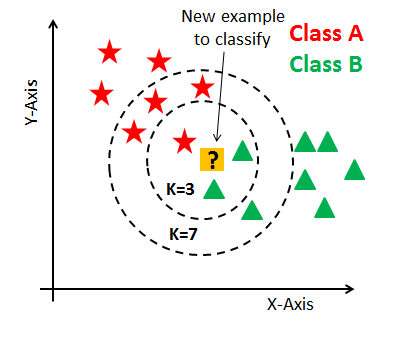

# K Nearest Neighbors (KNN) Algorithm
The K Nearest Neighbors (KNN) Algorithm is a versatile and straightforward method used for classification and regression tasks. It operates by finding the K nearest data points in the feature space and making predictions based on their labels or values.  

    

     

### Overview
KNN is a non-parametric algorithm, meaning it doesn't make any assumptions about the underlying data distribution. Instead, it relies on the local structure of the data to make predictions. By choosing an appropriate value for K, the algorithm can adapt to different complexities in the dataset.

KNN is commonly used for tasks such as image recognition, document classification, and recommendation systems. It is known for its simplicity and ease of implementation.

### Parameters
- **K**: The number of nearest neighbors to consider when making predictions. It's crucial to choose an appropriate value for K to balance bias and variance in the model.  

### Applications
- **Classification**: Identifying handwritten digits, classifying emails as spam or non-spam.   
- **Regression**: Predicting housing prices based on similar properties, estimating stock prices based on historical data.  

### Getting Started
To use the KNN algorithm:

1. Prepare your dataset and split it into training and testing sets.  
2. Choose an appropriate value for K.   
3. Train the model using the training data.
Make predictions on the test data.  
4. Evaluate the model's performance using metrics like accuracy or mean squared error.  

In this repository, we provide a simple implementation of KNN in Python, along with a sample dataset (Palmer Penguins) for training and testing purposes.