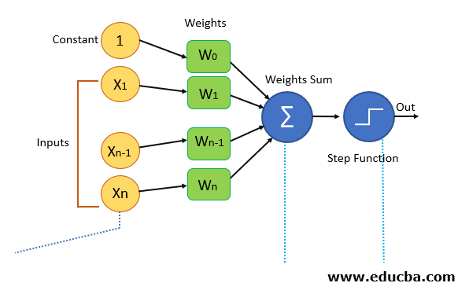

---
# Perceptron Algorithm 

The Perceptron Algorithm is a fundamental building block in the field of machine learning, particularly within the realm of artificial neural networks. 

    

  

### Brief History

#### Rise of the Perceptron Algorithm

The roots of the Perceptron algorithm trace back to the groundbreaking work of Warren McCullock and Walter Pitts in 1943. Their conceptualization of the McCullock-Pitts (MCP) neuron, a simplified brain cell functioning as a logic gate with binary outputs, laid the foundation for artificial neurons. Multiple signals arriving at dendrites were integrated into the cell body, and if the accumulated signal exceeded a threshold, an output signal was generated through the axon. This early model set the stage for the development of artificial neurons and, ultimately, the Perceptron.

#### Understanding Artificial Neurons: Bridging the Biological and Computational Realms

Artificial neurons, inspired by their biological counterparts, are mathematical functions within neural networks. These neurons process inputs by assigning weights, summing them, and passing the sum through a nonlinear function to produce an output. In comparison to biological neurons, artificial neurons mimic the role of cell nucleus, dendrites, synapse, and axon through their node, input, weights, and output components, respectively. The integration of artificial neurons in neural networks forms the backbone of modern machine learning.

#### Perceptron Unveiled: The Birth of Binary Classification

Introduced by Frank Rosenblatt in 1957, the Perceptron marked a significant leap in artificial intelligence. Building upon the MCP neuron, Rosenblatt proposed a Perceptron learning rule, facilitating supervised learning of binary classifiers. The Perceptron processes elements in the training set one at a time, enabling neurons to learn and adapt. Its simplicity, yet effectiveness, has made the Perceptron a cornerstone in the realm of machine learning, particularly for binary classification tasks.

---
